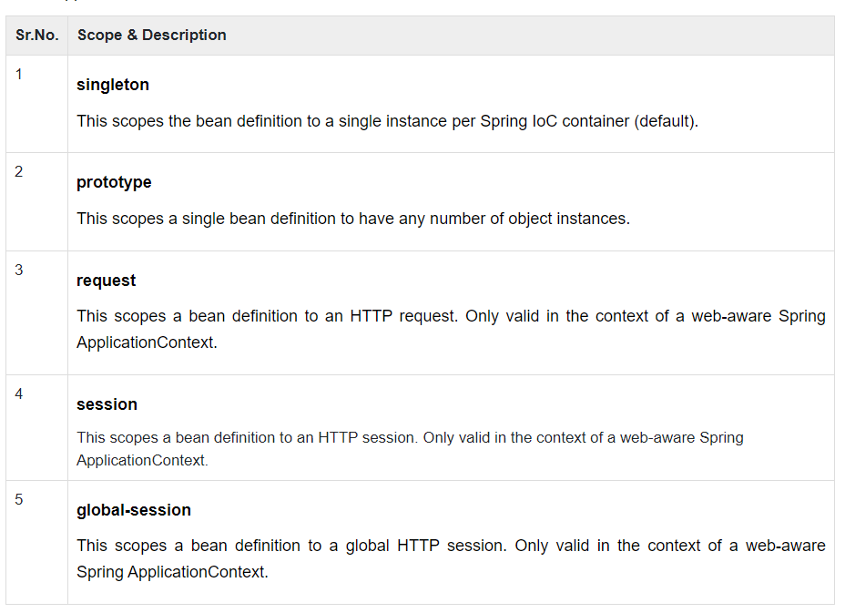
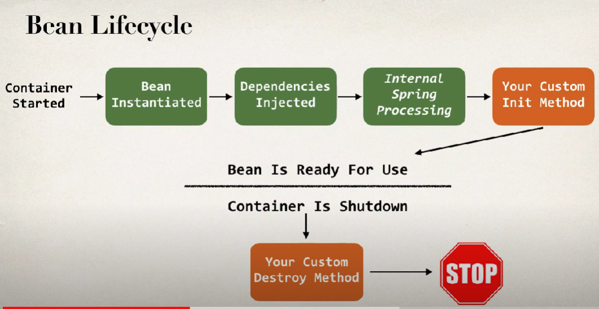
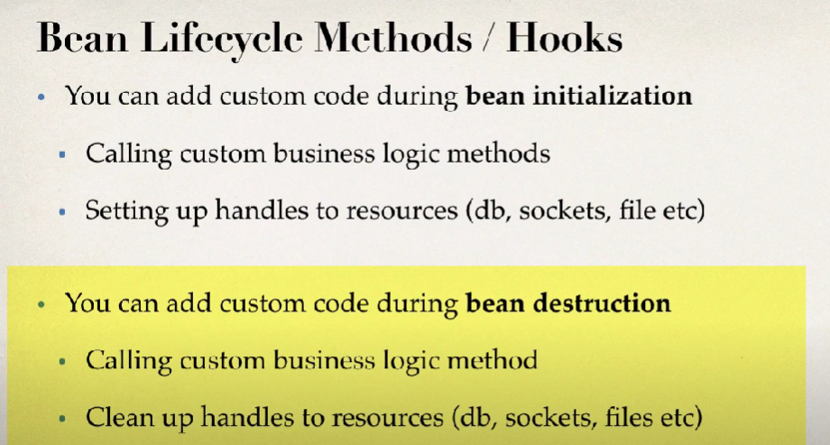
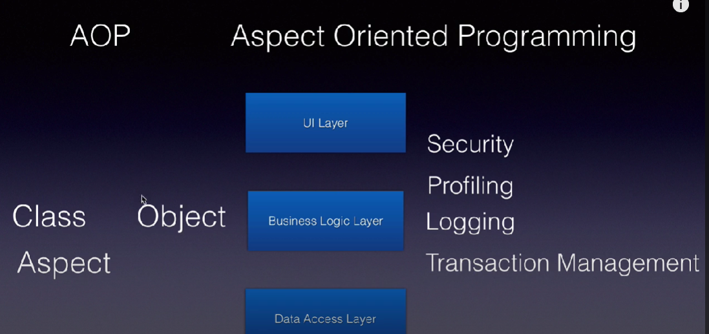
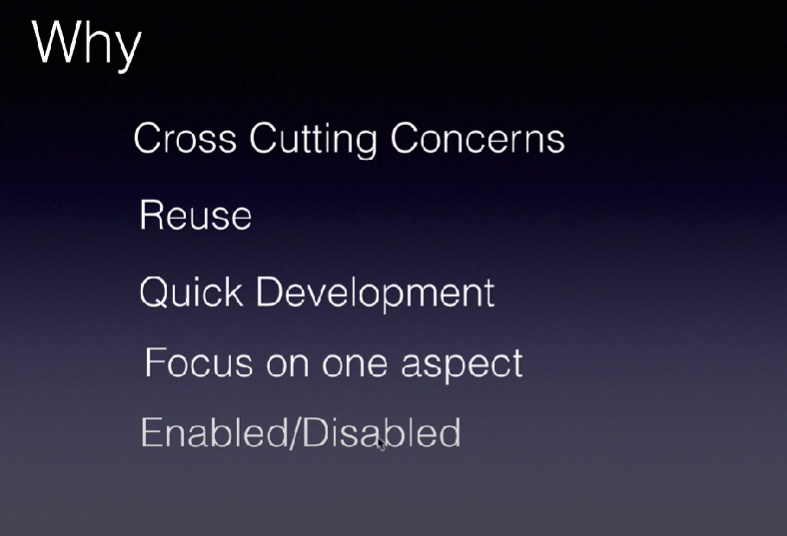

# Scope of Spring Bean

When defining a <bean> you have the option of declaring a scope for that bean. For example, to force Spring to produce a new bean instance each time one is needed, you should declare the bean's scope attribute to be prototype. Similarly, if you want Spring to return the same bean instance each time one is needed, you should declare the bean's scope attribute to be singleton.




The singleton scope
If a scope is set to singleton, the Spring IoC container creates exactly one instance of the object defined by that bean definition. This single instance is stored in a cache of such singleton beans, and all subsequent requests and references for that named bean return the cached object.

The default scope is always singleton. However, when you need one and only one instance of a bean, you can set the scope property to singleton in the bean configuration file, as shown in the following code snippet −

```
<!-- A bean definition with singleton scope -->
<bean id = "..." class = "..." scope = "singleton">
   <!-- collaborators and configuration for this bean go here -->
</bean>
```

Follow this link [Click here](https://www.tutorialspoint.com/spring/spring_bean_scopes.htm#)


# Bean Lifecycle





Follow this link [Click here](https://www.tutorialspoint.com/spring/spring_bean_life_cycle.htm#:~:text=The%20init%2Dmethod%20attribute%20specifies,is%20removed%20from%20the%20container.)

# Aspect oriented programming






