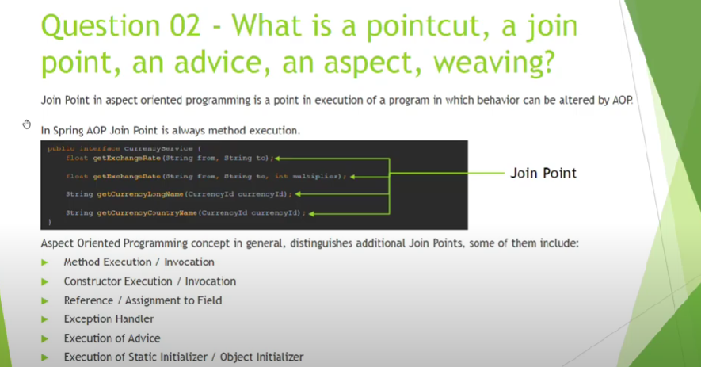

# AOP

Join Point: A join point is a specific point in the application such as method execution, exception handling, changing object variable values, etc. In Spring AOP a join point is always the execution of a method.

Pointcut: Pointcut is expressions that are matched with join points to determine whether advice needs to be executed or not. Pointcut uses different kinds of expressions that are matched with the join points and Spring framework uses the AspectJ pointcut expression language.